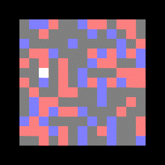

# DeepLearning
This repository contains my solutions to the homeworks of the DeepLearning
class from the Ecole Normale Supérieure (Master MVA).

Some large files are not uploaded in this repository. Here is an non exhaustive list:
+ crawl-300d-200k.vec to put in TP2/data and in TP2_ungraded/data
+ wiki.en.vec to put in TP2/data
+ wiki.fr.vec to put in TP2/data
+ W_mat.npy to create from the jupyter notebook from TP2

These word2vec can be downloaded on the internet.

## Information
In homework 3 you will be able to build an agent that can safely eat the
cheeses (red squares) and avoid the poisons (blue squares) in an environment
(See below gif)

